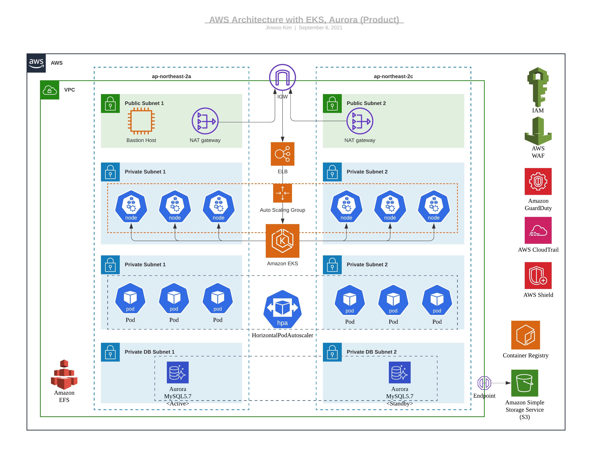

# Terraform example - UCMP

> Owner : LG유플러스
>
> Last Update : May, 2021
>
> Type : aws-u-cloud-service-infrastructure-1

## 설명

- Terraform 템플릿 - AWS EKS 배포 및 Ingress 구성

## 파일 정의

### [공통 파일]

- [0010_provider.tf](https://github.com/ucmp-template-repos/tf-aws-eks-ingress/blob/main/0010_provider.tf) 
  - CSP(AWS,GCP), Kubernetes 자원 설정을 위한 Provider 선언
- [0020_variables.tf](https://github.com/ucmp-template-repos/tf-aws-eks-ingress/blob/main/0020_variables.tf)
  - 프로젝트명, 자원이름, IP대역, COST_CENTER 등 프로젝트별로 특화된 값만 설정해서 coding을 최소화하도록 변수화함

### [Network]

- [0110_vpc.tf](https://github.com/ucmp-template-repos/tf-aws-eks-ingress/blob/main/0110_vpc.tf)
  - vpc(Virtual Private Cloud)에서는 subnet에서 사용할 사설 네트웍IP대역을 정의
- [0120_subnet.tf](https://github.com/ucmp-template-repos/tf-aws-eks-ingress/blob/main/0120_subnet.tf)
  - 인터넷 접근이 가능한 subnet과 불가한 subnet을 분리 생성하고 특성에 맞도록 EC2와 DB 등에서 설정
- [0130_igw.tf](https://github.com/ucmp-template-repos/tf-aws-eks-ingress/blob/main/0130_igw.tf)
  - 인터넷 접점 GATEWAY 역할의 internet gw 생성
- [0140_elastic_ip.tf](https://github.com/ucmp-template-repos/tf-aws-eks-ingress/blob/main/0140_elastic_ip.tf)
  - NAT 및 Bastion에서 인터넷 통신 시 활용할 Elastic IP(Public IP) 생성
- [0150_nat.tf](https://github.com/ucmp-template-repos/tf-aws-eks-ingress/blob/main/0150_nat.tf)
  - public IP가 할당되지 않은 subnet에서 인터넷 outbount 통신을 가능하게 하기 위한 NAT GW 생성
  - 운영팀 정책에 따라 NAT GW는 이중화 구성을 위해 2개 생성
- [0160_route_table.tf](https://github.com/ucmp-template-repos/tf-aws-eks-ingress/blob/main/0160_route_table.tf) 
  - 목적지(IP, S3)로 어떤 경로를 통해 전달할지 흐름에 대한 설정
  - public, private subnet 별, 그리고 S3 endpoint를 위한 routing table 설정
- [0170_security_group.tf](https://github.com/ucmp-template-repos/tf-aws-eks-ingress/blob/main/0170_security_group.tf)
  - IN/OUTBOUND 트래픽에 대해 차단/허용할지에 대한 설정

### [Computing]

- [0210_ekscluster.tf](https://github.com/ucmp-template-repos/tf-aws-eks-ingress/blob/main/0210_ekscluster.tf)
  - Cluster 생성 후 EKS 권한을 얻는 role 설정
- [0220_eks_node.tf](https://github.com/ucmp-template-repos/tf-aws-eks-ingress/blob/main/0220_eks_node.tf) 
  - EKS Cluster에 생성될 workernode의 스펙
  - EKS Cluster 연동
  - EKS workernode용 권한을 얻는 role 설정
- [0230_kubernetes.tf](https://github.com/ucmp-template-repos/tf-aws-eks-ingress/blob/main/0230_kubernetes.tf) 
  - EKS Cluster 연동을 위한 kubeconfig 설정
  - ingress-controller 배포 및 동작을 위한 Policy, Role, Attachment 생성
  - kubectl을 통한 cert-manager 및 ingress-controller 배포

### [DB]

- [0310_rds_aurora.tf](https://github.com/ucmp-template-repos/tf-aws-eks-ingress/blob/main/0310_rds_aurora.tf) 
  - AWS Aurora DB 이중화 구성
  - DB 전용 subnet 설정

### [Storage]

- [0410_s3.tf](https://github.com/ucmp-template-repos/tf-aws-eks-ingress/blob/main/0410_s3.tf) 
  - Contents 저장할 Object Storage S3 bucket 생성
  - Contents 접근 권한, VPC Endpoint 설정
- [0420_efs.tf](https://github.com/ucmp-template-repos/tf-aws-eks-ingress/blob/main/0420_efs.tf) 
  - 여러 서버에서 동시에 사용 가능하고 mount해서 서비스할 수 있는 File Storage(NAS) 생성
  - 자사 통합통계 등 로그 저장에서 활용 가능

### [Security]

- [0510_bastion_ec2.tf](https://github.com/ucmp-template-repos/tf-aws-eks-ingress/blob/main/0510_bastion_ec2.tf) 
  - EKS Private 접근을 위한 터미널 용 서버
- [0520_waf.tf](https://github.com/ucmp-template-repos/tf-aws-eks-ingress/blob/main/0520_waf.tf) 
  - web acl 적용

### [CI/CD]

- [0710_ecr.tf](https://github.com/ucmp-template-repos/tf-aws-eks-ingress/blob/main/0710_ecr.tf) 
  - Container 저장 설정

